# BelleCoder 🌹

A standalone **ESP32 (Cheap Yellow Display) dance-programmer wand** for the Hasbro *Dance Code
featuring Disney Princess Belle* doll. Build dance sequences on a touchscreen — or **by physically
dancing with the device** — and stream them to Belle over BLE. A dedicated toybox artifact that
replaces the discontinued Hasbro app: always paired, never expires, no phone or tablet needed.

<p align="center">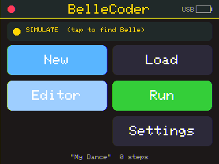</p>

<p align="center"><b>⚡ <a href="https://jamesdavid.github.io/BelleCoder/">Flash it from your browser</a></b> — plug in a CYD, click Install (Chrome/Edge). No toolchain needed.</p>

Everything below runs **today** on real hardware — every screenshot in this README was captured
from the live CYD over the serial debug loop. The doll's BLE protocol was fully reverse-engineered
(see [`docs/BLE_PROTOCOL.md`](docs/BLE_PROTOCOL.md)); the firmware builds the real command packets
and streams them when a doll is linked, and runs in a byte-accurate **SIMULATE** mode otherwise.

---

## What it does

- **Build dances on-device** — a tap-to-build editor with big, kid-friendly icons. No phone, no
  app store, no cloud.
- **Dance to Code** — wave, spin, and bounce the wand; the onboard IMU motion is segmented and
  classified into the *same* editable dance steps as the tap editor. "Your dance becomes code you
  can see and change."
- **Two skill tiers** — a **Kid** palette (Move / Arms / Spin / Dance, oversized tiles) and an
  **Advanced** palette (the full instruction set + REPEAT loops).
- **Preset library** — the 10 original Hasbro choreographies (extracted from the app) plus two
  BelleCoder originals (YMCA, Spin-Drop), each loaded as an editable sequence.
- **Real BLE** — NimBLE central scans for the doll, connects, and streams the recovered opcodes.
  Works in SIMULATE with no doll present.
- **One binary, capability-detected** — the IMU is optional and auto-detected on I2C; capture
  features turn on or hide entirely at boot.
- **A whole Play hub** — Draw-a-Dance (trace a path, Belle drives it), a song jukebox, Live Mirror
  (wave the wand, she copies you), and Simon Says — plus LED dress-light moves and Belle's own
  volume/battery. (See *More ways to play* below.)

---

## Screenshot tour

### Home & connect
Scan for Belle (tap the status band), see the SIMULATE/link state, and jump into New / Load /
Editor / Run / Settings. The battery indicator (top-right) reads the wand's LiPo, or shows **USB**
on bench power.

| Scanning for the doll | No doll found → SIMULATE |
|---|---|
| 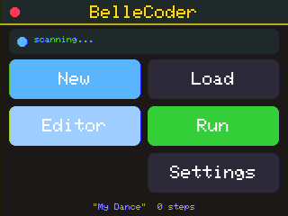 |  |

### Editor & palettes
Tap **+ Add** to open the palette, pick a move, set its parameter on the stepper, and build up a
sequence. Reorder with Up/Dn, delete, and tap the title to **Save**. Songs and dances show friendly
names ("Chip", "The Rose Waltz") instead of raw indices.

| Editor (built sequence) | Param stepper | Advanced palette |
|---|---|---|
|  | 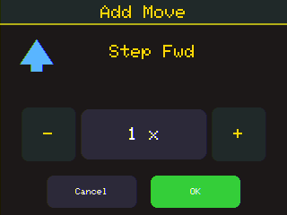 | 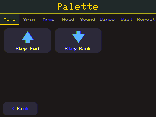 |

### Load & presets
The 10 extracted Hasbro dances + originals + your saved sequences. Presets convert from the raw
`{arm, l, r}` choreography into editable steps (Babette's 43 raw frames → 17 editable moves).

| Load screen | A preset, loaded & editable |
|---|---|
| 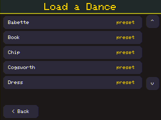 | 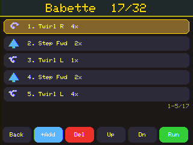 |

### Run
A non-blocking runner plays the sequence, highlights the live step with a synced progress bar, and
shows the **exact bytes** going to the doll. REPEAT loops expand at run time (`Step Fwd (x3)` →
"Step 1 of 3"). Stop sends a neutral settle (brake wheels, arms down).

<p align="center">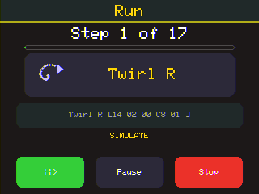</p>

### Dance to Code (the marquee feature)
Tap **Record**, hold still to calibrate, then dance. The wand shows live recognition feedback (a
spinning glyph while you spin, arrows for bounces/tilts) and a running move count. **Stop** drops
the classified steps into the editor for review.

| Recording (live feedback) | Captured → editor |
|---|---|
| 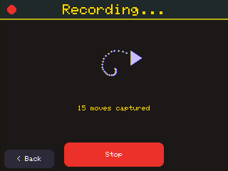 | 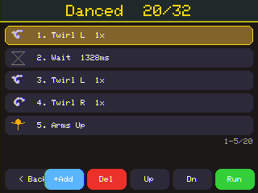 |

### IMU auto-detect & graceful degradation
One firmware image. If a supported IMU answers on I2C (verified by WHO_AM_I), the **Dance to Code**
button and capture settings appear. If not, they're **hidden entirely** — the child never sees a
dead button.

| No IMU → capture hidden | IMU present → capture shown | Capture settings |
|---|---|---|
|  | 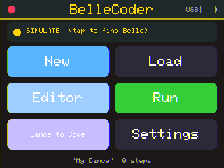 | 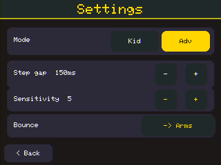 |

---

## More ways to play

Beyond the tap editor and motion capture, a **Play** hub (from Home) gathers the creative and game
modes. All are exercisable in SIMULATE.

<p align="center">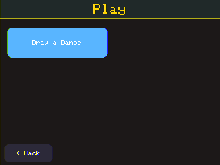</p>

### Draw-a-Dance ✏️
Trace a path on the touchscreen and Belle drives it — the original app's connect-the-dots idea,
rebuilt on our extracted `{arm, l, r}` model. The polyline is resampled into moves (straight runs →
Steps, corners → Twirls) and opens in the editor, fully tweakable.

| Trace a path | It becomes an editable dance |
|---|---|
| 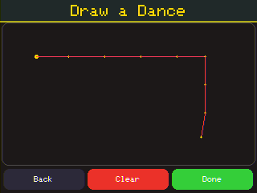 | 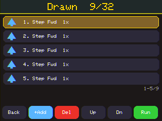 |

### Live Mirror & Simon Says
**Live Mirror** — wave the wand and Belle copies you in near-real-time (spin → she spins).
**Simon Says** — Belle demonstrates a growing sequence of moves; repeat it by tapping the tiles
(or, on a linked doll, driven by her necklace button).

| Live Mirror | Simon Says |
|---|---|
| 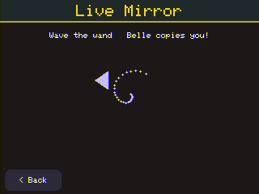 | 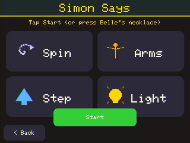 |

### Dance-Along, LED lights & Belle's controls
A **jukebox** of Belle's named songs; **LED dress-light** moves in an 8-colour palette (add "Light:
Teal" to any routine); and Belle's own **volume + battery** in Settings.

| Dance-Along | LED colour picker | Belle volume + battery |
|---|---|---|
| 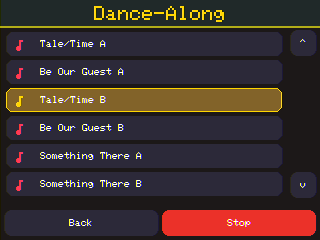 | 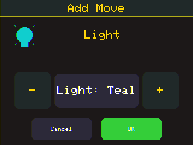 | 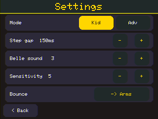 |

See [`BACKLOG.md`](BACKLOG.md) for what's next (autonomous queue playback, Freeze Dance, beat tools,
Perform mode, and the live-doll tuning that unlocks the notify-driven features).

---

## The wand (hardware)
A parametric OpenSCAD enclosure: display head + oval handle sized for small hands, rigid IMU boss,
LiPo cavity, wrist-strap slot, USB-C charge cutout. See [`hardware/`](hardware/).

<p align="center">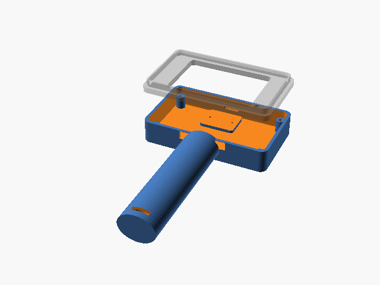</p>

---

## How it works

```
+------------------+      +-------------------+      +------------------+
|   UI Layer       |----->|  Sequence Model   |----->|  Player / Runner |
| (screens, touch) |      |  (steps, repeat)  |      |  (step pacing)   |
+------------------+      +-------------------+      +---------+--------+
         ^                     ^      |                         |
         |                     |      | save/load               | sendMove()
+--------+---------+           |      v                         v
| Motion Capture & |           |  +-------------------+  +------------------+
| Gesture Classify |-----------+  |  Storage (LFS)    |  |  PAL (protocol)  |
| (IMU -> steps)   |              +-------------------+  +---------+--------+
+--------+---------+                                               |
      IMU (I2C)                                          NimBLE central / SIMULATE
```

- **HAL** (`src/hal/`) — board-specific pins + LovyanGFX device, following the multi-target
  `-D BOARD_*` pattern (2.8" CYD default; CrowPanel S3 env stub). The 2.8" panel is driven
  landscape-native at MV=0 (rotation 6), with the empirically-derived readback colour mapping.
- **Canvas / screens** (`src/core/`, `src/screens/`) — draw against an abstract `Canvas`, never
  the concrete display type, so the UI is board-agnostic.
- **Model** (`src/model/`) — the shared `Sequence` (both the tap editor and the capture pipeline
  emit it).
- **PAL** (`src/pal/`) — the *only* doll-specific file: recovered UUIDs/opcodes, MotorRun-composed
  moves (start → wait → brake), audio/dance packets, per-move durations from the on-device catalog.
- **Services** (`src/services/`) — LittleFS storage, NimBLE central, LiPo battery monitor.
- **IMU + Capture** (`src/imu/`, `src/capture/`) — optional sensor abstraction + the
  record → segment → classify pipeline.

## The Belle protocol (reverse-engineered)

The doll's BLE protocol was recovered by decompiling the official *Dance Code* app (a Unity/Mono
build → clean C#). Full details in **[`docs/BLE_PROTOCOL.md`](docs/BLE_PROTOCOL.md)**; the recovered
source and reproducible pipeline are in [`re/`](re/) and [`scripts/re/`](scripts/re/). Headlines:

- Adv-name filter `DanceCD`; write char `51901383-…`, notify `51901382-…`; **Write Without
  Response**; **open GATT** (no bonding).
- Packets are `[opcode][params]`, ≤20 bytes. Belle is a **wheeled** doll: `STEP`/`TWIRL` compose
  from `MotorRun` (opcode 20); arms via `CamGoto` (25); audio via `PlayAudioSequence` (16); dances
  via `PlaySequence` (23).
- 412 onboard audio clips catalogued with kid-facing labels ([`data/audio_catalog.csv`](data/audio_catalog.csv)),
  10 named songs, 10 extracted preset dances ([`assets/presets/dances/`](assets/presets/dances/)).

## Build & flash

PlatformIO. The on-hand board is the 2.8" CYD (`cyd28_ili9341`, default env):

```bash
pio run -e cyd28_ili9341                 # build
pio run -e cyd28_ili9341 -t upload       # flash firmware over USB
pio run -e cyd28_ili9341 -t uploadfs     # flash the LittleFS image (data/: presets + catalog)
pio device monitor -b 115200             # serial console
```

**Going live with a real doll:** complete the §11.4 timing/power tuning, then flip
`#define BLE_ENABLED 1` in `src/pal/pal.h` and reflash. Until then it runs in SIMULATE and logs the
exact bytes.

## The autonomous debug loop

The firmware includes a GridBot/PIO_DEBUG-style serial console so the whole UI is verifiable with
no human holding the board — every screenshot here was captured this way:

```
S            screenshot  (framed RGB565 -> host PNG via scripts/dev/drive.py)
T <x> <y>    inject a tap at screen px
G <name>     navigate to a screen (home|editor|palette|run|settings|dance|load)
A            stream accel/gyro for a live plot
F            toggle a synthetic IMU (demo the capture UI without hardware)
P / I        colour-calibration pattern / device info
```

```bash
python scripts/dev/drive.py COM5 "nav editor; shot docs/img/editor.png"
```

## Milestones

| # | Milestone | Status |
|---|---|---|
| M0 | Skeleton: LovyanGFX, screens, PAL SIMULATE, serial debug loop | ✅ |
| M1 | Editor complete: add/insert/delete/reorder, params, Kid/Advanced palettes | ✅ |
| M2 | Persistence: LittleFS save/load + preset library | ✅ |
| M3 | BLE central: NimBLE scan/connect/status | ✅ |
| M4 | PAL real opcodes: MotorRun-composed moves, durations from catalog | ✅ |
| M5 | IMU bring-up + auto-detect, imuPresent gating, serial plot | ✅ |
| M6 | Dance to Code: segment + classify + live feedback | ✅ |
| M7 | Polish: REPEAT blocks, run-step sync, settle-on-stop, sensitivity | ✅ |
| M8 | Wand hardware: LiPo + charge/boost + battery ADC, OpenSCAD enclosure | ✅ |

## Repository layout

```
SPEC.md                  full v0.5 spec
docs/BLE_PROTOCOL.md     reverse-engineering results (fills the PAL)
docs/img/                on-device screenshots + renders
src/                     firmware (hal / core / model / pal / services / imu / capture / screens)
data/                    LittleFS image: presets + audio catalog
assets/presets/dances/   the 10 extracted dances + 2 originals ({arm,l,r})
re/                      decompiled BLE source (source of truth) + README
scripts/re/              reproducible RE pipeline (get_apk, decompile, extract)
scripts/dev/             serial UI driver + screenshot decoder + colour calibration
hardware/                parametric OpenSCAD wand + power/BOM/drop-test docs
platformio.ini           multi-target build (cyd28_ili9341 default, crowpanel_s3 stub)
```

## Notes

- **SIMULATE by design** — the entire app (editor, save/load, run pacing, capture) is exercisable
  with no doll. `sendMove()` logs the exact packet it *would* write.
- **Interoperability RE** — the protocol was recovered from an app for a toy we own, to replace the
  discontinued official app. The reverse-engineering artifacts are for that purpose.

<sub>🤖 Built with Claude Code on a real ESP32-2432S028R.</sub>
